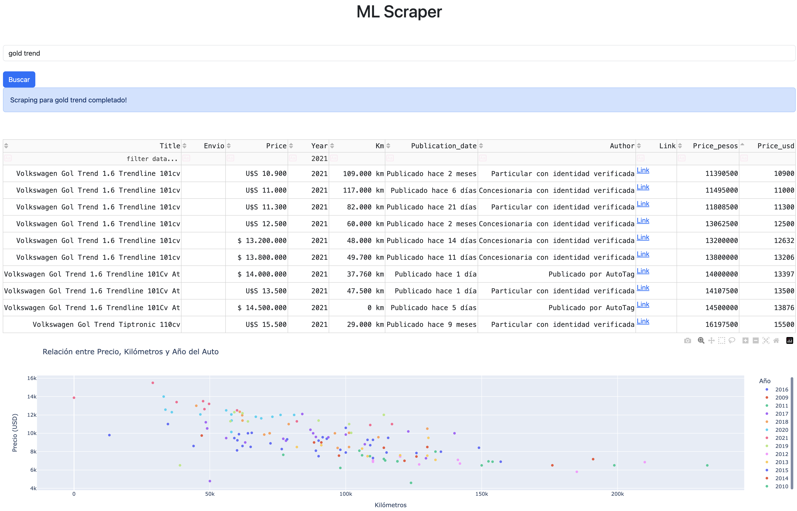

# MercadoLibre Scraper 🛒

[](https://github.com/PabloAlaniz/MercadoLibre-Scraper/actions/workflows/ci.yml)
[](https://www.python.org/)
[](https://opensource.org/licenses/MIT)

Herramienta de web scraping para MercadoLibre con dashboard interactivo (Dash) e interfaz de línea de comandos (CLI). Soporta 18 países de Latinoamérica con scrapers especializados por categoría (productos generales, autos e inmuebles).

## ✨ Características

- **Clean Architecture** — Dominio, aplicación, infraestructura y presentación desacoplados
- **Multi-retailer ready** — Container configurable para agregar nuevos retailers sin modificar el core
- **Soporte multi-país** — 18 países de LATAM (AR, MX, BR, CL, CO, etc.)
- **Interfaz dual:**
  - 🎨 Dashboard web interactivo (Dash + Flask + SocketIO)
  - 💻 Interfaz de línea de comandos (CLI)
- **Scrapers especializados:**
  - Productos generales (`MercadoLibreScraper`)
  - Autos (`CarScraper` → `CarProductDetail`)
  - Inmuebles (`PropertyScraper` → `PropertyProductDetail`)
- **Jerarquía de entidades** — `ProductDetail` base con extensiones `CarProductDetail` y `PropertyProductDetail`
- **Value Objects** — `Money`, `Kilometers`, `SquareMeters` con parsing y conversión
- **Exportación a CSV** con separador configurable
- **Conversión de moneda** — USD ↔ ARS via DolarAPI
- **Tests** — 127 unit + 23 integration
- **CI/CD** — GitHub Actions con ejecución automática de tests

## 📋 Requisitos

- Python 3.x
- Dependencias (se instalan via `requirements.txt`):
  - `requests` — Requests HTTP a MercadoLibre
  - `beautifulsoup4` — Parsing de HTML
  - `pandas` — Creación y manipulación de DataFrames
  - `tqdm` — Barras de progreso
  - `dash` + `Flask` — Interfaz web
  - `flask-socketio` — Notificaciones de progreso en tiempo real
  - `dash-bootstrap-components` — Componentes UI

## 🚀 Instalación

1. **Clonar el repositorio:**
```bash
git clone https://github.com/PabloAlaniz/MercadoLibre-Scraper.git
cd MercadoLibre-Scraper
```

2. **Instalar dependencias:**
```bash
pip install -r requirements.txt
```

3. **Ejecutar la aplicación:**
```bash
# Dashboard (interfaz web)
python main.py

# CLI (línea de comandos)
python cli_scraper.py
```

## 💡 Uso

### Dashboard web (Dash)

1. Iniciar el dashboard:
```bash
python main.py
```

2. Abrir el navegador en:
```
http://localhost:5003
```

3. **En la interfaz web:**
   - Seleccionar el país desde el dropdown
   - Ingresar el nombre del producto
   - Configurar la cantidad máxima de productos a escrapear
   - Hacer clic en "Buscar"
   - Ver resultados en gráficos y tablas

<p align="center"></br>Dashboard Home</p>

### Interfaz de línea de comandos (CLI)

```bash
python cli_scraper.py
```

**Seguir las indicaciones interactivas:**
```
País (ar/mx/br): ar
Producto: notebook gamer
Límite (default 100): 50
Se encontraron 50 productos.
```

Los resultados se exportan a `data/[nombre_producto].csv`.

## 📁 Arquitectura del proyecto

El proyecto sigue los principios de **Clean Architecture**:

```
MercadoLibre-Scraper/
├── domain/                         # Capa de dominio
│   ├── entities.py                 # ProductListing, ProductDetail, CarProductDetail, PropertyProductDetail
│   ├── value_objects.py            # Money, Kilometers, SquareMeters
│   ├── enums.py                    # Currency (enums genéricos)
│   └── ports.py                    # ScraperPort, ExchangeRatePort, ProgressNotifierPort, ProductExporterPort
│
├── application/                    # Capa de aplicación
│   ├── use_cases/
│   │   ├── search_products.py      # SearchProductsUseCase
│   │   └── get_product_details.py  # GetProductDetailsUseCase
│   └── services/
│       └── price_conversion.py     # PriceConversionService
│
├── infrastructure/                 # Capa de infraestructura (adapters)
│   └── adapters/
│       ├── csv_exporter.py         # CsvProductExporter
│       ├── dolarapi_client.py      # DolarApiExchangeRate
│       ├── socketio_notifier.py    # SocketIOProgressNotifier
│       └── null_notifier.py        # NullProgressNotifier (para CLI/tests)
│
├── presentation/                   # Capa de presentación
│   └── dash_presenter.py          # DashPresenter (formatea datos para el dashboard)
│
├── scrapers/                       # Scrapers por retailer
│   └── mercadolibre/
│       ├── mercadolibre_scraper.py # Scraper principal (productos generales)
│       ├── car_scraper.py          # Scraper especializado para autos
│       ├── property_scraper.py     # Scraper especializado para inmuebles
│       ├── enums.py                # Enums específicos de MercadoLibre
│       └── price_parser.py         # Parsing de precios de MercadoLibre
│
├── container.py                    # Composition root — ensambla dependencias
├── main.py                         # Entry point del dashboard
├── cli_scraper.py                  # Entry point del CLI
├── dashboard.py                    # Configuración de Dash + SocketIO
├── ui.py                           # Componentes UI del dashboard
├── callbacks.py                    # Callbacks de Dash (interactividad)
├── config.py                       # Constantes de configuración
├── log_config.py                   # Configuración de logging
├── utils.py                        # Funciones auxiliares
│
├── tests/                          # Tests unitarios e integración
│   ├── test_domain.py
│   ├── test_use_cases.py
│   ├── test_adapters.py
│   ├── test_presentation.py
│   ├── test_mercadolibre_scraper.py
│   ├── test_integration.py         # Tests de integración (requests reales)
│   └── test_utils.py
│
├── data/                           # Directorio de salida (CSVs)
└── docs/                           # Screenshots y documentación
```

## 🔧 Configuración

Editar `config.py` para personalizar:

```python
SERVER_CONFIG = {
    "debug": True,
    "port": 5003
}

SCRAPER_CONFIG = {
    'base_url': 'https://listado.mercadolibre.com.{domain}/',
    'page_increment': 50,
    'max_pages': 100
}

DATA_DIRECTORY = "data"
CSV_SEPARATOR = ";"
```

## 🌎 Países soportados

El scraper soporta 18 países de Latinoamérica:

| Código | País            | Dominio |
|--------|-----------------|---------|
| AR     | Argentina       | .ar     |
| BO     | Bolivia         | .bo     |
| BR     | Brasil          | .br     |
| CL     | Chile           | .cl     |
| CO     | Colombia        | .co     |
| CR     | Costa Rica      | .cr     |
| DO     | Rep. Dominicana | .do     |
| EC     | Ecuador         | .ec     |
| GT     | Guatemala       | .gt     |
| HN     | Honduras        | .hn     |
| MX     | México          | .mx     |
| NI     | Nicaragua       | .ni     |
| PA     | Panamá          | .pa     |
| PY     | Paraguay        | .py     |
| PE     | Perú            | .pe     |
| SV     | El Salvador     | .sv     |
| UY     | Uruguay         | .uy     |
| VE     | Venezuela       | .ve     |

## 🧪 Tests

Ejecutar tests unitarios (excluye integration por defecto):

```bash
pytest tests/ -v
```

Ejecutar tests de integración (realizan requests reales a MercadoLibre):

```bash
pytest tests/ -v -m integration
```

Ejecutar todos los tests:

```bash
pytest tests/ -v -m ""
```

## 🔌 Cómo agregar un nuevo retailer

1. **Implementar `ScraperPort`** — Crear un nuevo scraper en `scrapers/nuevo_retailer/`:

```python
# scrapers/nuevo_retailer/mi_scraper.py
class MiScraper:
    """Implementa ScraperPort via duck typing (Protocol)."""

    def get_page_content(self, url):
        ...

    def scrape_product_list(self, domain, product_name, user_scraping_limit):
        ...

    def scrape_product_details(self, soup):
        ...
```

2. **Registrar en el Container** — Agregar el retailer en `container.py`:

```python
@staticmethod
def _create_scraper(retailer: str, notifier, config=None):
    if retailer == 'mercadolibre':
        from scrapers.mercadolibre.mercadolibre_scraper import MercadoLibreScraper
        return MercadoLibreScraper(progress_notifier=notifier, config=config)
    if retailer == 'nuevo_retailer':
        from scrapers.nuevo_retailer.mi_scraper import MiScraper
        return MiScraper(progress_notifier=notifier, config=config)
    raise ValueError(f"Unknown retailer: {retailer}")
```

3. **Instanciar con el nuevo retailer:**

```python
services = Container.create_for_cli(retailer='nuevo_retailer')
```

## 🗺️ Roadmap

- [x] Sort para el orden de los resultados
- [x] Scraper secundario que trae info extra de cada producto
- [x] Tests unitarios e integración (127 + 23)
- [x] CI/CD pipeline (GitHub Actions)
- [x] Clean Architecture (refactor completo)
- [ ] Input para elegir la cantidad de páginas a escrapear
- [ ] Gráfico de barras con la distribución del precio
- [ ] Export a Excel (xlsx)
- [ ] Docker support
- [ ] API REST para scraping on-demand
- [ ] Scheduled scraping (cron jobs)
- [ ] Base de datos (PostgreSQL/SQLite)

## 📝 Notas

- **Rate limiting:** Ser respetuoso con los servidores de MercadoLibre. Usar límites razonables.
- **Robots.txt:** Este scraper es para fines educativos. Revisar los términos de servicio de MercadoLibre antes de hacer scraping a gran escala.

## 🔧 Troubleshooting

### El dashboard no inicia
**Problema:** Error `Address already in use` al ejecutar `python main.py`

**Solución:**
```bash
# Encontrar y matar el proceso usando el puerto 5003
lsof -ti:5003 | xargs kill -9

# O cambiar el puerto en config.py
SERVER_CONFIG = {"port": 5004}
```

### No se devuelven resultados
**Problema:** El scraper retorna lista vacía o 0 productos

**Posibles causas:**
1. **MercadoLibre cambió su estructura HTML** → Actualizar selectores CSS en `MercadoLibreScraper`
2. **Rate limiting/bloqueo** → Agregar delays entre requests, rotar user agents
3. **Dominio de país inválido** → Verificar que el código de país exista en la tabla de países soportados
4. **Problemas de red** → Verificar conexión a internet

### ModuleNotFoundError
**Problema:** `ModuleNotFoundError: No module named 'dash'` (u otras dependencias)

**Solución:**
```bash
pip install -r requirements.txt --upgrade
```

### Error al exportar CSV
**Problema:** `PermissionError` o `FileNotFoundError` al exportar

**Solución:**
```bash
mkdir -p data
chmod 755 data/
```

## 📄 Licencia

Este proyecto está licenciado bajo la Licencia MIT.

---

**Autor:** Pablo Alaniz
